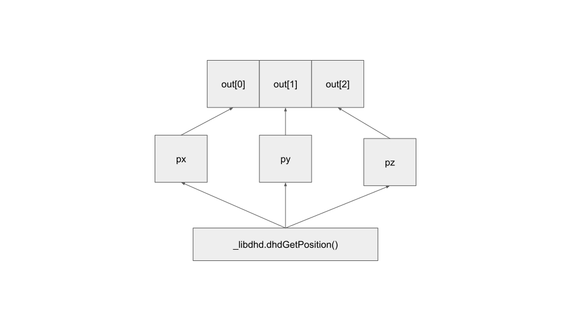

Direct Copy Optimization
========================
.. note::

   This feature was introduced in v1.0.0

Direct copy optimization allows C code to directly copy data into a Python data structure.
This allows for less overhead when calling specific functions that load data into some container.
This overhead can be nontrivial for functions that have to convert many native C types to Python types
(e.g. :func:`forcedimension_core.dhd.getPositionAndOrientationFrame()`
must perform 12 float allocations and copies).

Functions which support direct copy optimization are loaded under a special module called
``direct`` in the :mod:`forcedimension_core.dhd`,
:mod:`forcedimension_core.dhd.expert`, and :mod:`forcedimension_core.drd` modules.

These functions require that you use the special containers in :mod:`forcedimension_core.containers`.
Below is a brief example (omitting error checking for brevity).

.. code:: python

   import forcedimension_core.containers as containers
   import forcedimension_core.dhd as dhd

   dhd.open()

   pos = containers.Vector3()

   # Equivalent to: dhd.getPosition(out=pos)
   dhd.direct.getPosition(out=pos)

Theory of Operation
===================

.. note::
   This section is left for library developers and higher level users.
   It requires a knowledge of how pointers in C work to fully understand.

Under the hood, direct copy optimization is nothing special. The below image shows
how :func:`forcedimension_core.dhd.getPosition()` works.

Each arrow represents a copy in the in the diagram
The library invokes the C function ``_libdhd.dhdGetPosition()`` and stores the data from it
in :class:`ctypes.c_double` buffers called ``px``, ``py``, ``pz``. Then, it copies the data to a the ``out``
container. As we can see, it would be faster if we could copy the data directly into a Python container.

The code for it is shown below (without docstrings), noting the overhead.

.. code:: python

  def getPosition(out: MutableArray[int, float], ID: int = -1) -> int:
    # Extra allocation here
    px = c_double()
    py = c_double()
    pz = c_double()

    # px, py, and pz are pased byref and data is copied into them
    err = _runtime._libdhd.dhdGetPosition(px, py, pz, ID)

    # Extra copy here
    out[0] = px.value
    out[1] = py.value
    out[2] = pz.value

    return err

In general, ``_libdhd.dhdGetPosition()`` needs float pointers to the data you wish to copy to.
The solution then, is to use a type, which can directly pass pointers to
``_libdhd.dhdGetPosition()`` like :class:`array.array`.
3rd party libraries like NumPy also have this capability. Below we show a bare-bones version
of the library implementation.

.. code:: python

  class Vector3(array):
      def __new__(cls, initializer: Iterable[float] = (0., 0., 0.)):
        if isinstance(initializer, array):
          return initializer

        arr = super(Vector3, cls).__new__(cls, 'd', initializer)

        if len(arr) != 3:
          raise ValueError()

        return arr

      def __init__(self, *args, **kwargs):
        super().__init__(*args, **kwargs)

        # Get a pointer to the front of the array
        ptr = self.buffer_info()[0]

        self._ptrs = (
            ctypes.cast(ptr, c_double_ptr),  # 0th element
            ctypes.cast(ptr + self.itemsize, c_double_ptr),  # 1st element
            ctypes.cast(ptr + 2 * self.itemsize, c_double_ptr),  # 2nd element
        )

      @property
      def ptrs(self) -> Tuple[c_double_ptr, c_double_ptr, c_double_ptr]:
        return self._ptrs

  def getPosition(out: SupportsPtrs3[c_double], ID: int = -1) -> int:
    return _runtime._libdhd.dhdGetPosition(*out.ptrs, ID)

:class:`forcedimension_core.containers.Vector3` simply adds an additional property to a Python
:class:`array.array` called ``ptrs``. Now ``_libdhd.dhdGetPosition()`` can be given pointers to the
memory inside the container itself, saving us an allocation and a copy.
